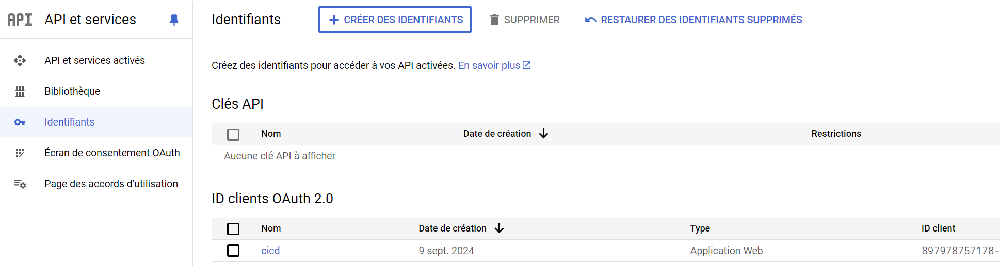

===================
sessions-management
===================

About The Project
=================

This project automates robotics session notifications to the French American School of New York 
who generously host the MantaBots team

.. image:: https://badgen.net/github/checks/MantaBots27318/sessions-management
   :target: https://github.com/MantaBots27318/sessions-management/actions/workflows/release.yml
   :alt: Status
.. image:: https://badgen.net/github/commits/MantaBots27318/sessions-management/main
   :target: https://github.com/MantaBots27318/sessions-management
   :alt: Commits
.. image:: https://badgen.net/github/last-commit/MantaBots27318/sessions-management/main
   :target: https://github.com/MantaBots27318/sessions-management
   :alt: Last commit

Built And Packaged With
-----------------------

.. image:: https://img.shields.io/static/v1?label=python&message=3.12.5rc1&color=informational
   :target: https://www.python.org/
   :alt: Python

Principle
=========

This python scripts performs the following steps :

1) Analyze a google calendar to gather events using Google Calendar API:

   - Which are due to happen in the next N days
   - Whose Summary contains a given topic
   - Which have not been registered yet, or whose registration date have changed ( see below )

2) Select the name of the attendees from a contact list using Google People API:

   - Fron the selected event, attendees email addresses are selected
   - The email address are matched against contact list
   - The contacts are marked as students if their title is Team Member, as adults if their title is Coach and as mentors if their title is mentor. Other title are not considered

3) Build a registration email from the pattern text file

   - Replacing {{adults}}, {{students}} and {{mentors}} by the attendees names
   - Replacing {{start_time}} and {{end_time}} by the event start and end time
   - Replacing {{team}} by the team name
   - Replacing {{date}} by the start time day

4) Sends the email to the recipient using either an external smtp server or the Gmail API

5) Update calendar events extended properties to mark them as sent, with the associated registration date

Getting Started
===============

Prerequisite
------------

- An autorized oauth user shall have been declared in GCP, for the account owning the calendar and the contact list :

- A secret shall have been created for this user
- A test app shall have been declared in GCP consent screen tab

Configuration
-------------

The script uses both a configuration file for non secret value, and command line to input secret values

The non secret configuration data are located into a `configuration file`_
The configuration file format is given below :

.. code-block:: JSON

   {
      "team" : <Team name to copy into email>,
      "mail" : { 
         "from" : {
               "smtp_server" : <smtp server address if not using google>,
               "smtp_port"   : <smtp server port if not using google>,
               "address"     : <sender address>
         },
         "to" : <recipient address>,
         "pattern" : <mail pattern text file, see `example`_>,
      },
      "calendar" : {
         "id" : <google calendar identifier>,
         "topic" : <topic to look for in events to register>,
         "days" : <Number of days from now into which events will be considered>,
         "full_day" : <if "True", registration declare people are present from 12AM to 11:59PM whatever the session date, if "False" uses event hours>
      }
      
   }

.. _`example`: conf/mail-pattern.txt
.. _`configuration file`: conf/conf.json

Secrets
-------

2 additional secret information are required :

- The smtp server password if not using gmail 
- The google API token enabling access to Google Calendar API (rw), Google Calendar Events API (rw), Google People API (ro) and Gmail API as a token.json file

.. code-block:: JSON

   {
      "token": <authorized oauth user short term token - will be refreshed if no longer valid>,
      "refresh_token": <authorized oauth user long term refresh token>,
      "token_uri": "https://oauth2.googleapis.com/token",
      "client_id": <MY_CLIENT_ID>,
      "client_secret": <MY_CLIENT_SECRET>,
      "scopes": ["https://www.googleapis.com/auth/contacts.readonly", "https://www.googleapis.com/auth/calendar.events", "https://www.googleapis.com/auth/gmail.send", "https://www.googleapis.com/auth/calendar"]
   }

The token and refresh token value can be gathered the following way :

- In a web browser, enter address : 
.. code-block:: bash

   https://accounts.google.com/o/oauth2/auth?redirect_uri=https%3A%2F%2Fmantabots.org&prompt=consent&response_type=code&client_id=<MY CLIENT ID>.apps.googleusercontent.com&scope=https%3A%2F%2Fwww.googleapis.com%2Fauth%2Fgmail.send+https%3A%2F%2Fwww.googleapis.com%2Fauth%2Fcalendar.events+https%3A%2F%2Fwww.googleapis.com%2Fauth%2Fcalendar+https%3A%2F%2Fwww.googleapis.com%2Fauth%2Fcontacts.readonly&access_type=offline replacing <MY_CLIENT_ID> by the correct value

- Select the user owning the calendar and the contact list for authentication
- Accept everything even what is marked as risky
- You'll be redirected to 

.. code-block:: bash
   https://mantabots.org/?code=<THE CODE I WANT>&scope=https://www.googleapis.com/auth/contacts.readonly%20https://www.googleapis.com/auth/calendar.events%20https://www.googleapis.com/auth/calendar%20https://www.googleapis.com/auth/gmail.send

- In the command line, use curl :

.. code-block:: bash

   curl -X POST https://oauth2.googleapis.com/token -H "Content-Type: application/x-www-form-urlencoded" \
        -d "client_id=<MY_CLIENT_ID>.apps.googleusercontent.com" \
        -d "client_secret=<MY_CLIENT_SECRET>" \
        -d "code=<THE CODE I WANT>" \
        -d "grant_type=authorization_code" \
        -d "redirect_uri=https://mantabots.org"

The result will contain a short term token and a long term token to update the token.json file

Usage
-----

In an environmentin which python, pip and bash has been installed : 

.. code-block:: bash

   ./scripts/register.sh -k <My_TOKEN_FILE> -c <MY_CONF_FILE> -p <MY_SMTP_PASSWORD_IF_NEEDED> -t <RECIPIENT_ADDRESS> -f <SENDER_ADDRESS>

In an environemnt in which docker is available :

.. code-block:: bash

   ./scripts/launch.sh -k <My_TOKEN_FILE> -c <MY_CONF_FILE> -p <MY_SMTP_PASSWORD_IF_NEEDED> -t <RECIPIENT_ADDRESS> -f <SENDER_ADDRESS>

..code:bashrc

Testing
=======

Tested With
-----------

.. image:: https://img.shields.io/static/v1?label=python&message=3.12.5rc1&color=informational
   :target: https://www.python.org/
   :alt: Python
.. image:: https://img.shields.io/static/v1?label=robotframework&message=7.1&color=informational
   :target: http://robotframework.org/
   :alt: Robotframework

Environment
-----------

Tests can be executed in an environment :

* in which python, pip and bash has been installed, by executing the script `scripts/robot.sh`_, or

* in which docker is available, by using the `python image`_ in its latest version, which already contains python, pip and bash, by executing the script `scripts/test.sh`_

.. _`python image`: https://hub.docker.com/_/python/
.. _`scripts/robot.sh`: scripts/robot.sh
.. _`scripts/test.sh`: scripts/test.sh

Results
-------

The test results for latest release are here_

.. _here: https://MantaBots27318.github.io/sessions-management/report.html

Issues
======

.. image:: https://img.shields.io/github/issues/MantaBots27318/sessions-management.svg
   :target: https://github.com/MantaBots27318/sessions-management/issues
   :alt: Open issues
.. image:: https://img.shields.io/github/issues-closed/MantaBots27318/sessions-management.svg
   :target: https://github.com/MantaBots27318/sessions-management/issues
   :alt: Closed issues

Roadmap
=======

Contributing
============

.. image:: https://contrib.rocks/image?repo=MantaBots27318/sessions-management
   :alt: GitHub Contributors Image

Contact
=======

MantaBots - contact@mantabots.org