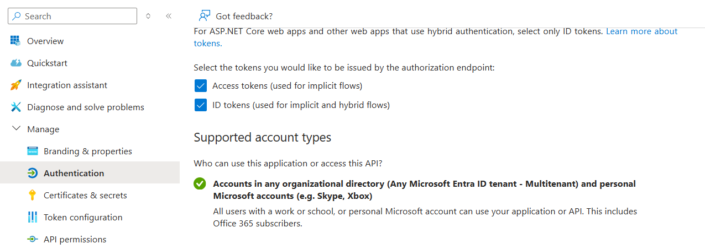
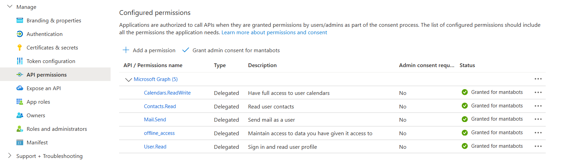
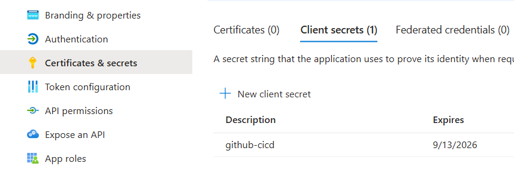

===================
sessions-management
===================

About The Project
=================

This project automates robotics session notifications to the French American School of New York
who generously host the MantaBots team

.. image:: https://badgen.net/github/checks/MantaBots27318/sessions-management
   :target: https://github.com/MantaBots27318/sessions-management/actions/workflows/release.yml
   :alt: Status
.. image:: https://badgen.net/github/commits/MantaBots27318/sessions-management/main
   :target: https://github.com/MantaBots27318/sessions-management
   :alt: Commits
.. image:: https://badgen.net/github/last-commit/MantaBots27318/sessions-management/main
   :target: https://github.com/MantaBots27318/sessions-management
   :alt: Last commit

Built And Packaged With
-----------------------

.. image:: https://img.shields.io/static/v1?label=python&message=3.12.6rc1&color=informational
   :target: https://www.python.org/
   :alt: Python

Principle
=========

This python scripts performs the following steps :

1) Analyze a Microsoft calendar to gather events using Microsoft Graph API:

   - Which are due to happen in the next N days
   - Whose Summary contains a given topic
   - Which have not been registered yet, or whose registration date have changed ( see below )

2) Select the name of the attendees from a contact list using Microsoft Graph API:

   - Fron the selected event, attendees email addresses are selected
   - The email address are matched against contact list
   - The contacts are marked as students if their title is Team Member, as adults if their title is Coach and as mentors if their title is mentor. Other title are not considered

3) Build a registration email from the pattern text file

   - Replacing {{adults}}, {{students}} and {{mentors}} by the attendees names
   - Replacing {{start_time}} and {{end_time}} by the event start and end time
   - Replacing {{team}} by the team name
   - Replacing {{date}} by the start time day

4) Sends the email to the recipient using either an external smtp server or the Microsoft Graph API

5) Update calendar events extended properties to mark them as sent, with the associated registration date

Getting Started
===============

Prerequisites
-------------

- An Azure subscription shall have been created for the personal account owning the contact list

- An app shall have been declared in Microsoft Entra ID, with the following authentication settings :
   * Redirect URI shall be set to https://mantabots.org
   * Implicit grant shall be set to Access tokens and ID tokens
   * Access tokens shall be set to Read and write calendars in all mailboxes, Read user contacts, Send mail as a user, Read user profile

- The app shall be granted the following API permissions :
   * offline_access enables to maintain the acquired authorization the app has for the Microsoft personal account
   * User.Read enables to get personal account information
   * Calendars.ReadWrite enables to get calendar events and update them with registration date
   * Contacts.Read enables to get contact list
   * Mail.Send enables to send email

- A secret shall have been created for this user :

Configuration
-------------

The script uses both a configuration file for non secret value, and command line to input secret values

The non secret configuration data are located into a `configuration file`_
The configuration file format is given below :

.. code-block:: JSON

   {
      "team" : <Team name to copy into email>,
      "mail" : {
         "from" : {
            "smtp_server" : {
                "host" : <smtp server address if not using Microsoft>,
                "port" : <smtp server port if not using Microsoft>
            },
            "imap_server" : {
                "host" : <imap server address if not using Microsoft>,
                "port" : <imap server port if not using Microsoft>
            },
            "address"     : <sender address>
         },
         "to" : <recipient address>,
         "pattern" : <mail pattern text file, see `example`_>,
      },
      "calendar" : {
         "name" : <Microsoft calendar name>,
         "topic" : <topic to look for in events to register>,
         "days" : <Number of days from now into which events will be considered>,
         "full_day" : <if "True", registration declare people are present from 12AM to 11:59PM whatever the session date, if "False" uses event hours>,
         "time_zone" : <Time zone into which events shall be registered>
      }

   }

.. _`example`: conf/mail-pattern.txt
.. _`configuration file`: conf/conf.json

Secrets
-------

SMTP and IMAP server
********************

   If not using gmail, you'll need the password of the smtp server your sending address uses to connect

Microsoft token
****************

The Microsoft Graph API token enabling access to Microsoft Users (r), Microsoft Calendar API (rw), Microsoft Contact API (ro) and Microsoft Mail API as a token.json file

Format
######

.. code-block:: JSON

   {
      "token": <authorized oauth user short term token - will be refreshed if no longer valid>,
      "refresh_token": <authorized oauth user long term refresh token>,
      "token_uri": "https://login.microsoftonline.com/common",
      "client_id": <MY_CLIENT_ID>,
      "client_secret": <MY_CLIENT_SECRET>,
      "tenant_id": "9188040d-6c67-4c5b-b112-36a304b66dad",
      "scopes": ["Contacts.Read", "Calendars.ReadWrite", "Mail.Send", "User.Read"]
   }

N.B : The tenant_id is the default value for personal accounts, not the one from the organizational account in which the app has been created

Content
#######

The token and refresh token value can be gathered the following way :

- In a web browser, enter address :
.. code-block:: bash

   https://login.microsoftonline.com/common/oauth2/v2.0/authorize?client_id=<MY CLIENT ID>&response_type=code&redirect_uri=https://mantabots.org&response_mode=query&scope=offline_access%20Contacts.Read%20Calendars.ReadWrite%20Mail.Send%20User.Read

- Select the user owning the calendar and the contact list for authentication
- You'll be redirected to

.. code-block:: bash
   https://mantabots.org/?code=<AUTHORIZATION CODE>

- In the command line, use curl :

.. code-block:: bash

   curl -X POST https://login.microsoftonline.com/common/oauth2/v2.0/token \
     -H "Content-Type: application/x-www-form-urlencoded" \
     -d "client_id=<MY_CLIENT_ID>" \
     -d "scope=offline_access Contacts.Read Calendars.ReadWrite Mail.Send User.Read" \
     -d "code=<AUTHORIZATION CODE>" \
     -d "redirect_uri=https://mantabots.org" \
     -d "grant_type=authorization_code" \
     -d "client_secret=<MY_CLIENT_SECRET>"

The result will contain a short term token and a long term token to update the token.json file

Usage
-----

In an environmentin which python, pip and bash has been installed :

.. code-block:: bash

   ./scripts/register.sh -k <My_TOKEN_FILE> -c <MY_CONF_FILE> -p <MY_SMTP__AND_IMAP_PASSWORD_IF_NEEDED> -t <RECIPIENT_ADDRESS> -f <SENDER_ADDRESS>

In an environemnt in which docker is available :

.. code-block:: bash

   ./scripts/launch.sh -k <My_TOKEN_FILE> -c <MY_CONF_FILE> -p <MY_SMTP__AND_IMAP_PASSWORD_IF_NEEDED> -t <RECIPIENT_ADDRESS> -f <SENDER_ADDRESS>

..code:bashrc

Testing
=======

Tested With
-----------

.. image:: https://img.shields.io/static/v1?label=python&message=3.12.6rc1&color=informational
   :target: https://www.python.org/
   :alt: Python
.. image:: https://img.shields.io/static/v1?label=robotframework&message=7.1&color=informational
   :target: http://robotframework.org/
   :alt: Robotframework

Environment
-----------

Tests can be executed in an environment :

* in which python, pip and bash has been installed, by executing the script `scripts/robot.sh`_, or

* in which docker is available, by using the `python image`_ in its latest version, which already contains python, pip and bash, by executing the script `scripts/test.sh`_

.. _`python image`: https://hub.docker.com/_/python/
.. _`scripts/robot.sh`: scripts/robot.sh
.. _`scripts/test.sh`: scripts/test.sh

Results
-------

The test results for latest release are here_

.. _here: https://MantaBots27318.github.io/sessions-management/report.html

Issues
======

.. image:: https://img.shields.io/github/issues/MantaBots27318/sessions-management.svg
   :target: https://github.com/MantaBots27318/sessions-management/issues
   :alt: Open issues
.. image:: https://img.shields.io/github/issues-closed/MantaBots27318/sessions-management.svg
   :target: https://github.com/MantaBots27318/sessions-management/issues
   :alt: Closed issues

Roadmap
=======

Contributing
============

.. image:: https://contrib.rocks/image?repo=MantaBots27318/sessions-management
   :alt: GitHub Contributors Image

Contact
=======

MantaBots - contact@mantabots.org