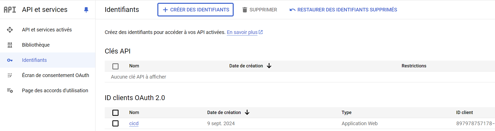

=====================
google-configuration
=====================

Prerequisites
=============

A GCP subscription shall have been created for the personal account owning the contact list

Setting up the Google Project To Access Personal Account Data
=============================================================

1. Go To API and Services and select Enable APIs and Services. Activate APIs for :
   * Google Calendar API
   * Google People API
   * Gmail API

2. Setup the oauth consent screen with the following parameters :
   * User Type : External
   * Add as test users the mail of your personal account. This will allow you to use the consent screen without having to publish it
   * Scopes : Add the following scopes :
     - https://www.googleapis.com/auth/contacts.readonly
     - https://www.googleapis.com/auth/calendar.events
     - https://www.googleapis.com/auth/gmail.send
     - https://www.googleapis.com/auth/calendar
     - https://www.googleapis.com/auth/userinfo.email
     - https://www.googleapis.com/auth/userinfo.profile

3. Create the oauth client ID for the app, with the following parameters :
    * Application type : Web Application
    * Authorized redirect URIs : https://mantabots.org
    * Retrieve the secret and store it in a safe place

Retrieving API access credentials
=================================

Format
------

.. code-block:: JSON

   {
      "token": <authorized oauth user short term token - will be refreshed if no longer valid>,
      "refresh_token": <authorized oauth user long term refresh token>,
      "token_uri": "https://oauth2.googleapis.com/token",
      "client_id": <MY_CLIENT_ID>,
      "client_secret": <MY_CLIENT_SECRET>,
      "scopes": ["https://www.googleapis.com/auth/contacts.readonly", "https://www.googleapis.com/auth/calendar.events", "https://www.googleapis.com/auth/gmail.send", "https://www.googleapis.com/auth/calendar", "https://www.googleapis.com/auth/userinfo.email", "https://www.googleapis.com/auth/userinfo.profile"]
   }

Content
-------

The token and refresh token value can be gathered the following way :

- In a web browser, enter address :
.. code-block:: bash

   https://accounts.google.com/o/oauth2/auth?redirect_uri=https%3A%2F%2Fmantabots.org&prompt=consent&response_type=code&client_id=<MY CLIENT ID>&scope=https%3A%2F%2Fwww.googleapis.com%2Fauth%2Fgmail.send+https%3A%2F%2Fwww.googleapis.com%2Fauth%2Fcalendar.events+https%3A%2F%2Fwww.googleapis.com%2Fauth%2Fuserinfo.email+https%3A%2F%2Fwww.googleapis.com%2Fauth%2Fuserinfo.profile+https%3A%2F%2Fwww.googleapis.com%2Fauth%2Fcalendar+https%3A%2F%2Fwww.googleapis.com%2Fauth%2Fcontacts.readonly&access_type=offline  replacing <MY_CLIENT_ID> by the correct value

- Select the user owning the calendar and the contact list for authentication
- Accept everything even what is marked as risky
- You'll be redirected to

.. code-block:: bash
   https://mantabots.org/?code=<AUTHORIZATION CODE>&scope=https://www.googleapis.com/auth/contacts.readonly%20https://www.googleapis.com/auth/calendar.events%20https://www.googleapis.com/auth/calendar%20https://www.googleapis.com/auth/gmail.send

- In the command line, use curl :

.. code-block:: bash

   curl -X POST https://oauth2.googleapis.com/token -H "Content-Type: application/x-www-form-urlencoded" \
        -d "client_id=<MY_CLIENT_ID>" \
        -d "client_secret=<MY_CLIENT_SECRET>" \
        -d "code=<AUTHORIZATION CODE>" \
        -d "grant_type=authorization_code" \
        -d "redirect_uri=https://mantabots.org"

The result will contain a short term token and a long term token to update the token.json file

Setting up the Google Calendar trigger
======================================

Creating the trigger
--------------------

1. Log onto the Google account owning the calendar
2. Go to `Google Apps Scripts`_ and create a new project
3. Create the onEventChange function in the script editor with a simple log statement for testing
4. In your script editor, go to Triggers (clock icon) or click Triggers in the left sidebar, then click Add Trigger.
5. Choose your function (onEventChange in this case), change the notification delai to immediately
6. Set the event source to from calendar and configure the calendar owner email
7. The first time you run the script or set the trigger, you will need to authorize the script to access your Google Calendar.
8. Test the Trigger by changing an event in the specified calendar
9. In your script editor, go to Execution to check that the trigger has fired correctly

.. _`Google Apps Scripts`: https://script.google.com/home?pli=1

.. warning::
    Google only enable triggering scripts on events declared on the user main calendar

Connecting to the Github CI/CD script
-------------------------------------